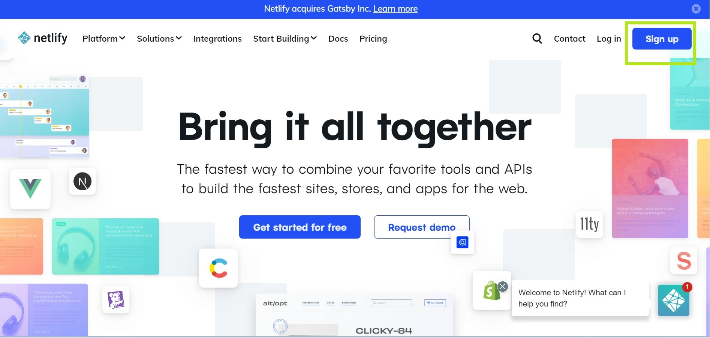
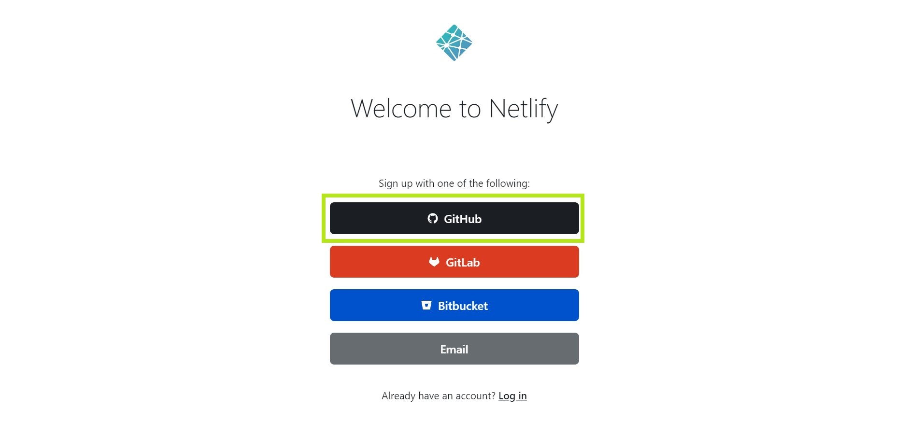
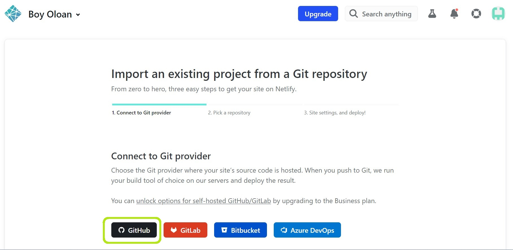

# Setup Netlify and Custom Domain

> This is a mandatory assignment for this week

## Sign Up for New Account on Netlify

1. Access the web by this link : https://www.netlify.com/ and Click sign up on top right corner of web

2. If you already have Github account, you can simply connect it with clicking Github option in the middle of the web

3. After doing that process, scroll down to find "Add Site" option and then it will appear 3 options. If you already had repository on Github, you can simply select option "Import an existing project"

4. On this page, select Github in the middle bottom

