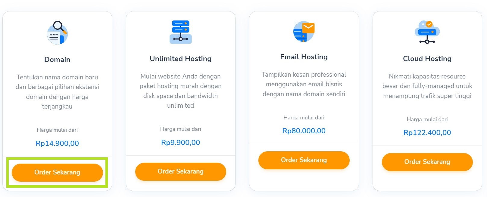
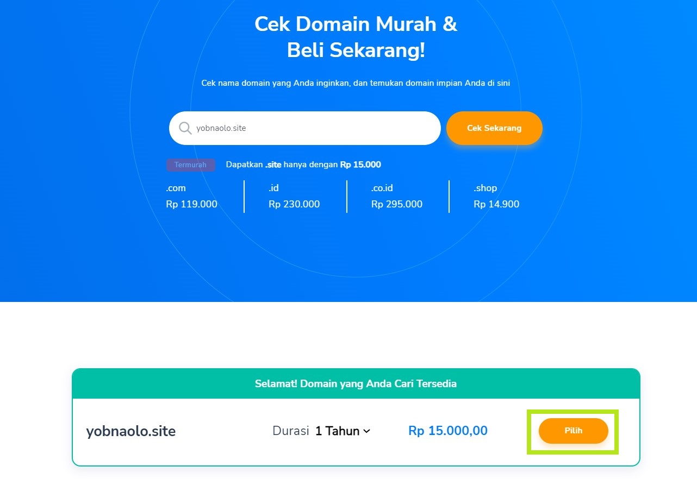
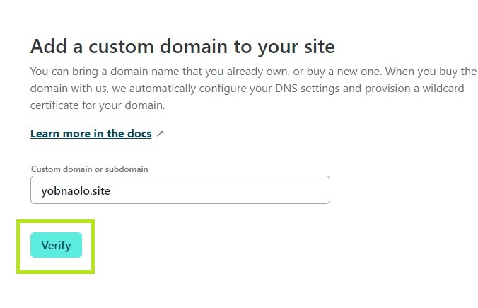
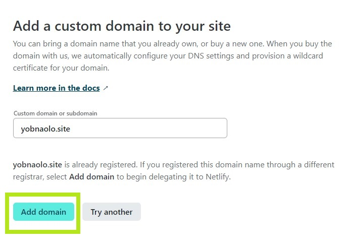

# Setup Netlify and Custom Domain

> This is a mandatory assignment for this week

## Sign Up for New Account on Netlify

1. Access the web by this link : https://www.netlify.com/ and click sign up on top right corner of web

2. If you already have Github account, you can simply connect it with clicking Github option in the middle of the web

3. After doing that process, scroll down to find "Add Site" option and then it will appear 3 options. If you already had repository on Github, you can simply select option "Import an existing project"

4. On this page, select Github in the middle bottom and automatically will authorize the account to give permission for using that account

5. Then select repository that contains your web files on bottom of the page. In this case, I want to publish assignment for Week 4 so I choose w4-my-portfolio-yobnaolo

6. After that, the new window appears and if you do not have advanced configuration, you can simply click on the "deploy site" button

7. Then if you successfully deploy your website, new page will occur to notify that new website has been deployed with certain random link

8. You can trigger deployment to your web if Github does not push the updated content of your web by selecting menu Deploy under your name in the top left and then choose "Trigger deploy" on the bottom right

9. If you try to click Trigger deploy option, Log page will appear to show you if there is a change or not to your web

10. For addition, you can change name of your web but the domain still connected to netlify by select "Site settings"

then on the new page select "Change site name"

## Change Domain Name With Custom

1. You can pick one of many custom domain platform as you wish. In this case, I choose Niagahoster to create specific domain name to my website

2. Then login on your account to continue

3. Scroll down and then select menu "Domain" and click "Order Sekarang"

4. On the search prompt, find any domain that you want and then click "cek sekarang". If it is available, it will show under the search prompt and we can buy that domain

5. After selecting the domain name, new page will navigate to the payment system. Check at the domain name then click "lanjutkan"

6. Select any payment method you want and then click "checkout"

7. Wait until your payment is verified and entitled with "Lunas"

8. Navigate to Cloudflare website and then log in with your account

9. On the homepage, click "add site" then on the prompt coloumn, enter your website link as you have bought before

10. Select any plan you want, in this case I choose "Free" to host the web

11. On this page, fill in the prompt coloumn with certain settings as you want. In this case, I choose type CNAME and enter the Netlify domain name on provided box. Then click save and continue

12. Get back to Niagahoster and change the nameserver with other ones provided by Cloudflare then click "Simpan"

13. Navigate back to Netlify and select "Domain Management"

14. On this page, click button "Add Domain"

Fill the box with custom domain then click "Verify"

Click "Add Domain"

15. After those are successfully done, you can visit the web with custom domain

